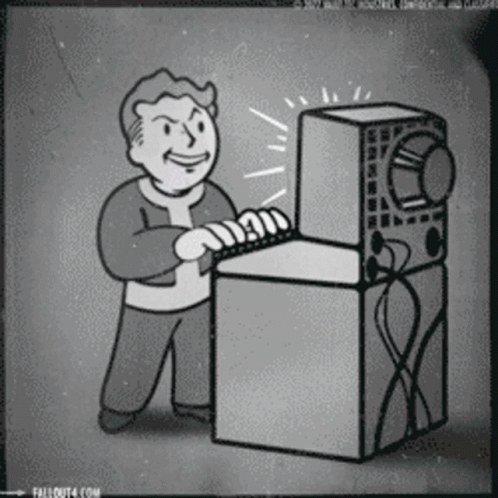
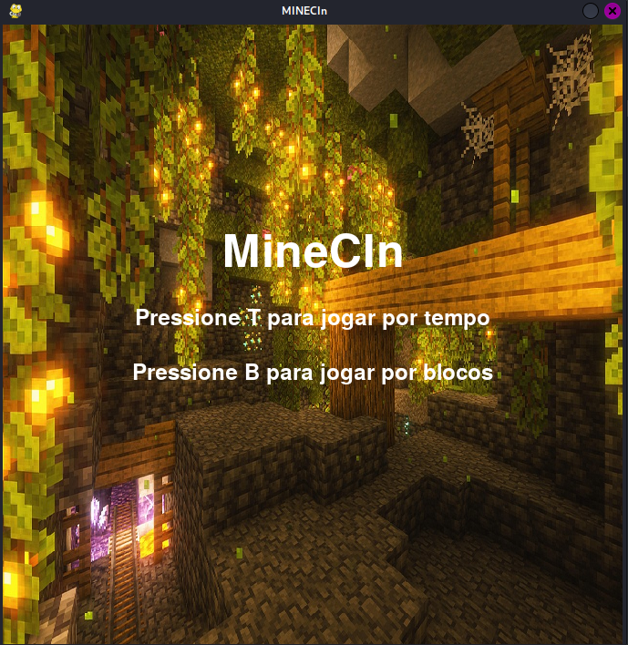

# Projeto-IP  
Projeto final da disciplina de Introdução á Programação  

Título do projeto: MINECIn  

Membros da equipe: 
João Victor Presbytero <jvpacqg>
Pierre Antônio da Silva<pas2>
Rafael Cardoso Clementino de Siqueira <rccs2>
Uirajan José da Silva <ujs>
Maria Rosicler Lúcia de Lima <mrll>

#A descrição da arquitetura do projeto:
  
  O MINECIn é um divertido jogo desenvolvido na linguagem python com a utilização da biblioteca pygame, onde o jogador assume o papel de ROBOCIN, mas o protagonista tem alguns problemas e precisa de você para poder sair de uma mina sinistra com sua saúde reestabelecida quer entender o contexto?  
  <table>
    <tr>
      <td>
        
      </td>
    </tr>
  </table
    
CONTEXTO:  
"Enquanto passava tranquilamente pelas ruas da UFPE,",
        "Robocin foi surpeendido por um grupo de bandidos buscando seus fios de cobre",
        "Completamente incapacitado, Robocin foi carregado a um lugar escuro e desconhecido da universidade",
        "Lá, a última coisa que pode sentir foi o cortar da serra da makita que usavam para lhe lobotomizar",
        ".     .     .",
        "Quando acordou, estava desmaiado no tapete da entrada do CIN",
        "Gritando por ajuda com os últimos circuitos que lhe restavam,",
        "Robocin foi encontrado pelo professor Ricardo Massa",
        "Após descobri-lo nesse estado precário, Ricardo não tardou em descartá-lo,",
        "jogando-o direto nas profundezas das minas do CIN",
        "Era um lugar assustador, sabia Robocin, rezervado apenas para as maiores atrocidades",
        "sabia ele que jaziam lá os ossos daqueles que reprovavam em Introdução à programação",
        'roídos incessantemente pelos dentes secos dos asuras chamados de "monitores chefes"',
        "viam-se acorrentados Byte e Troia, forçados a participar no triste teatro de uma batalha sem fim",
        "destinados a atrair mais vítimas para a armadilha dos monitores chefes",
        "e no horizonte, um tenebroso cemitério, mais vasto do que o mar do tártaro,",
        "preenchido em cada metro seu pelas carcassas de passadas cafeteiras",
        "Nas profundezas da mina, Robocin encontrou com aquilo de mais absurdo, mais tenebroso, mais ...",
        "encontrou outros Robocins. Seus passados eus, seus amigos ...",
        "todos resultados da mesma sina,",
        "todos tristes vitimas da makita.",
        "Mas naquele lugar... Não eram mais Robocins.",
        "Na mina, reina a lei dos fios de cobre, reina a lei daquele mais forte",
        "das placas de Ouro, dos punhos de Magnetita, dos muros inquebráveis",
        "reina a lei do tempo, e da ferrugem inevitável",
        "a lei da escassez, e da fome",
        "Será que Robocin conseguirá sobreviver?"  
  
TIPO DE JOGO: “Top to Down”  
MULTIPLAYER: Sim  
ESTRUTURA VISUAL: Pixel Art  
TIPO DE CONTROLADOR: TECLADO  
MAPEAMENTO DO TECLADO:  

<table>
<tr>
  <th colspan="6" align="center">TECLA</th>
</tr>
  <tr>
    <td width= "120" align= "center">JOGADOR 1</td>
    <td width= "120" align= "center">W</td>
    <td width= "120" align= "center">A</td>
    <td width= "120" align= "center">S</td>
    <td width= "120" align= "center">D</td>
    <td width= "120" align= "center">F</td>
  </tr>
  <tr>
    <td>JOGADOR 2</td>
    <td width= "120" align= "center" style="font-size:12px">↑</td>
    <td width= "120" align= "center" style="font-size:12px">←</td>
    <td width= "120" align= "center" style="font-size:12px">↓</td>
    <td width= "120" align= "center" style="font-size:12px">→</td>
    <td width= "120" align= "center" style="font-size:12px">0</td>
  </tr>
  
  <tr>
    <td>O QUE FAZ</td>
    <td align = "center">movimenta o personagem para a frente</td>
    <td align = "center">movimenta o personagem para a esquerda</td>
    <td align = "center">movimenta o personagem para trás</td>
    <td align = "center">movimenta o personagem para a direita</td>
    <td align = "center">minerar</td>
  </tr>
</table>


#Explicando como o código foi organizado  


CLASSES

```mermaid
classDiagram
  Personagem : x_personagem
  Personagem : y_personagem
  Personagem : +mostrar()
  Personagem : +minerar()
  pygame.sprite.Sprite <|--Icone
  Icone : +x_pos
  Icone : +y_pos
  Icone <|-- Icone_magnetita
  Icone <|-- Icone_cobre
  Icone <|-- Icone_ouro
  Icone_magnetita: +definir()
  Icone_cobre: +definir()
  Icone_ouro: +definir()
  pygame.sprite.Sprite <|-- Pedra
  Pedra <|-- Magnetita
  Pedra <|-- Cobre
  Pedra <|-- Ouro
  Pedra <|-- Muro
  Pedra : +x_pedra
  Pedra : +y_pedra
  Pedra : +durabilidade=1
  Pedra : +image
  Pedra : +cor
  Pedra : +rect
  Pedra: +definir()
  Pedra: +mostrar()
  Pedra: +quebrar()
  Pedra: +restaurar()
      class Magnetita{
          +definir()
          +quebrar()
      }
      class Cobre{
          +definir()
          +quebrar()

      }
      class Ouro{
          +definir()
          +quebrar()

      }
      class Muro{
          +definir()
          +quebrar()

      }

 ```


#As capturas de tela do sistema funcionando para compor a galeria de projetos:  

FASE DE DESENVOLVIMENTO:  
<table>
  <tr>
    <td></td>
    <td></td>
  </tr>
  <tr>
    <td></td>
    <td></td>
  </tr>
</table>
<table>
  <tr>
    <td>
  </tr>
</table>
<table>
  <tr>
    <td>
  </tr>
</table>  


FASE DE IMPLEMENTAÇÃO:  
<table>
  <tr>
    <td></td>
  </tr>
</table>  

#As ferramentas, bibliotecas, frameworks utilizados com as respectivas justificativas para o uso;  
*Linguagem de Programação:  
  A linguiagem de programação escolhida foi o Python, por conveniencia da disciplina de Introdução a lógica de programação(IP) 
do primeiro período da disciplina de Ciência da Computação do Centro de Informática da UFPE.  
*Módulos:  
  O principal módulo utilizado para o desenvolveomento foi o Pygame, por sugestão de praticidade e por permitir desenvolver num curto espaço de tempo, além da 
flexibilidade de se trabalhar com arte pixelada que também facilita a usabilidade do módulo. As artes(sprites) foram geradas utilizando a ferramenta web
PIXILART disponível em: https://www.pixilart.com/.  
  O módulo random foi utilizado para gerar aleatoriedade(através da função randint()) no que tange a durabilidade das rochas e sua distribuição.    
  O módulo sys foi utilizado para permitir o controle da tela(fechamento) através da função exit().  

#A divisão de trabalho dentro do grupo (quem fez o quê);  
<table>
  <tr>
    <th>MEMBRO</th>
    <th>FUNÇÃO INICIAL ATRIBUÍDA</th>
    <th>O QUE FEZ</th>
  </tr>
  
  <tr>
    <td>João Victor Presbytero </td>
    <td>Designer de Nível</td>
    <td>Responsável por montar o mapa inicial do jogo (o mundo de mineração), 
        Implementar componentes e solucionar problemas de integração
    </td>
  </tr>
  
  <tr>
    <td>Maria Rosicler Lúcia de Lima</td>
    <td>Designer de Mecânicas</td>
    <td>Lógica de mineração (interação com blocos), o sistema de inventário 
    (contagem dos 3 coletáveis) e a condição de vitória/fim de jogo.
    </td>
  </tr

  <tr>
    <td>Pierre Antônio da Silva</td>
    <td>Designer de Som</td>
    <td>Edição dos sons e música do jogo</td>
  </tr>
  
  <tr>
    <td>Rafael Cardoso Clementino de Siqueira</td>
    <td>Arquiteto de Jogo / Programador Líder</td>
    <td>Definiu a estrutura central (loop principal, estados), gerenciou a integração dos componentes
        garantiu a comunicação entre os módulos (player, mundo, UI), e também solucionou os problemas de integração.
    </td>
  </tr>
  
  <tr>
    <td>Uirajan José da Silva</td>
    <td>Designer de Assets</td>
    <td>Criou os gráficos em pixel art, assets visuais, ícones dos coletáveis 
        (sprites do jogador, blocos, os 3 coletáveis, mapa) e elementos de UI.
    </td>
  </tr>
</table>


#Os conceitos que foram apresentados durante a disciplina e utilizados no projeto (indicando onde foram usados);  
  No projeto, excetuando a parte de programação orientada a objeto, todas os conceitos aprendidos foram utilizados direta ou indiretamente,
sendo portanto destacados a seguir:  

Python: Características Básicas  
  *Laços de Repetição (while / for)  
     Onde e para que foi usado:  
        for: Utilizado na função tela_historia() para percorrer strings e criar o efeito de digitação, e na função mapear() para percorrer a matriz do mapa.  
        while True: O "Game Loop" principal que mantém a janela aberta e o jogo processando frames continuamente.  
  *Estruturas Condicionais (if / elif / else)  
     Onde e para que foi usado:  
        Utilizado para mapear as entradas do teclado (movimentação e ações de minerar).  
        Verificação de colisões entre o rect do jogador e os blocos de minério.  
        Controle de limites da tela para impedir que o personagem saia da área visível.  
  *Coleções (Listas e Dicionários)  
     Onde e para que foi usado:  
        Listas: A variável mapa armazena a estrutura do cenário como uma matriz. A lista rect_pedras armazena as instâncias dos objetos de minério para renderização.  
        Dicionários: Usado em self.items dentro da classe Personagem para gerenciar o inventário, onde cada chave é o nome do mineral e o valor é a quantidade coletada.  
  *Funções (def)  
     Onde e para que foi usado:  
        Modularização do sistema de geração de mapa (construir, espelhar, mapear) e funções de interface (tela_de_inicio, transicao).  
        Programação Orientada a Objetos (Classes e Herança) Onde e para que foi usado:  
  *Classes: Estruturação dos objetos Personagem e Pedra.    
     Herança: As classes Magnetita, Cobre e Ouro herdam de Pedra, reaproveitando a lógica de durabilidade, mas definindo suas próprias imagens e recompensas específicas (Polimorfismo).  
  *Bibliotecas Externas (Import)  
     Onde e para que foi usado:  
        pygame: Motor gráfico do jogo.  
        random: Para sortear a posição e o tipo dos minérios, garantindo que o mapa seja gerado de forma aleatória em cada execução.  
        sys: Para controlar a janela de execução do jogo.  

##Os desafios e erros enfrentados no decorrer do projeto e as lições aprendidas. Para tanto, respondam às seguintes perguntas:  
#Qual foi o maior erro cometido durante o projeto? Como vocês lidaram com ele?  
  Talvez tenha sido uma atribuição tardia das funções. Para lidar com isso estabelecemos metas de curto prazo.  

#Qual foi o maior desafio enfrentado durante o projeto? Como vocês lidaram com ele?  
  O gerenciamento do tempo não ficou muito estabelecido, o que causou um certo atraso no desenvolvimento da parte gráfica, principalmente.  
  Para lidar com isso tornamos a comunicação mais dinâmica, onde cada participante fornecia exatamente o que estava fazendo, 
onde estava fazendo e qual o andamento do processo a fim de nortear os outros integrantes.  

#Quais as lições aprendidas durante o projeto?  
  Desenvolver um jogo por mais simples que seja,exige muita disciplina, tempo e organização, onde cada etapa otimizada através da cooperação leva a uma
maior propensão da aplicação ser bem sucedida.  
  A curva de aprendizado da ferramenta utilizada é baixa, permitindo o desenvolvimento de jogos simples em poucos dias.  

